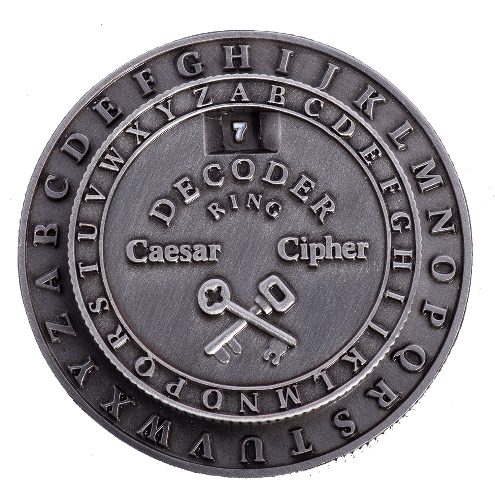

<h1 align="center">
    
</h1>

<h4 align="center">
  🚀 Desafio Codenation - Cifra de Cesar
</h4>

  
  

## 👨🏼‍💻 Projeto

Segundo o Wikipedia, criptografia ou criptologia (em grego: kryptós, “escondido”, e gráphein, “escrita”) é o estudo e prática de princípios e técnicas para comunicação segura na presença de terceiros, chamados “adversários”. Mas geralmente, a criptografia refere-se à construção e análise de protocolos que impedem terceiros, ou o público, de lerem mensagens privadas. Muitos aspectos em segurança da informação, como confidencialidade, integridade de dados, autenticação e não-repúdio são centrais à criptografia moderna. Aplicações de criptografia incluem comércio eletrônico, cartões de pagamento baseados em chip, moedas digitais, senhas de computadores e comunicações militares. Das Criptografias mais curiosas na história da humanidade podemos citar a criptografia utilizada pelo grande líder militar romano Júlio César para comunicar com os seus generais. Essa criptografia se baseia na substituição da letra do alfabeto avançado um determinado número de casas. Por exemplo, considerando o número de casas = 3:

Normal: a ligeira raposa marrom saltou sobre o cachorro cansado

Cifrado: d oljhlud udsrvd pduurp vdowrx vreuh r fdfkruur fdqvdgr

## 🚔 Regras
As mensagens serão convertidas para minúsculas tanto para a criptografia quanto para descriptografia. Escrever programa, em qualquer linguagem de programação, que faça uma requisição HTTP para a url abaixo:

        https://api.codenation.dev/v1/challenge/dev-ps/generate-data?token=SEU_TOKEN

Para encontrar o seu token , acesse a plataforma Codenation, faça o login e a informação estará na tela, conforme no exemplo abaixo.

    {
	    "numero_casas": 10,
	    "token":"token_do_usuario",
	    "cifrado": "texto criptografado",
	    "decifrado": "aqui vai o texto decifrado",
	    "resumo_criptografico": "aqui vai o resumo"
    }

O primeiro passo é você salvar o conteúdo do JSON em um arquivo com o nome answer.json, que irá usar no restante do desafio.

Você deve usar o número de casas para decifrar o texto e atualizar o arquivo JSON, no campo decifrado. O próximo passo é gerar um resumo criptográfico do texto decifrado usando o algoritmo sha1 e atualizar novamente o arquivo JSON. OBS: você pode usar qualquer biblioteca de criptografia da sua linguagem de programação favorita para gerar o resumo sha1 do texto decifrado.

Seu programa deve submeter o arquivo atualizado para correção via POST para a API:

        https://api.codenation.dev/v1/challenge/dev-ps/submit-solution?token=SEU_TOKEN

OBS: a API espera um arquivo sendo enviado como multipart/form-data, como se fosse enviado por um formulário HTML, com um campo do tipo file com o nome answer. Considere isso ao enviar o arquivo.

## 🔨 Tecnologias

- [JavaScript](https://developer.mozilla.org/pt-BR/docs/Aprender/JavaScript)
- [Node.js](https://nodejs.org/en/)
- [JSON](https://www.json.org/json-en.html)

## 🔄 Executar
 - Fazer clone do repositório.

### 🔧 Back-end
 - Entrar na pasta do repositório;
 - Executar `yarn install` para instalar dependências do projeto;
 - Executar `yarn dev` para que o projeto seja executado;

## ♻️ Como contribuir
- Faça um fork desse repositório;
- Crie uma branch com a sua feature: `git checkout -b minha-feature`
- Commit suas mudanças: `git commit -m ':emoji: feat: My new feature'`
- Push a sua branch: `git push origin my-feature`

## 📝 Licença
Este projeto está sobre a licença MIT. Veja o arquivo [LICENSE](LICENSE.md) para mais detalhes.

---

<h4 align="center">
  Feito com ❤️ by Gustavo Souza
</h4>